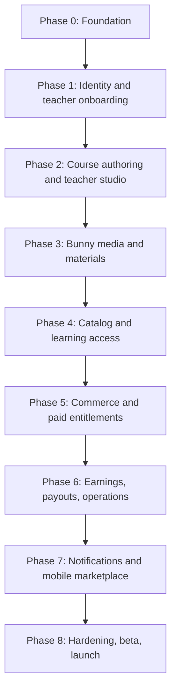

# JapanGoLearn SaaS Implementation Plan

Status: canonical execution plan  
Last updated: 2026-07-22  
Implementation owner: this Codex chat  
Chosen video provider: Bunny Stream

## 1. Purpose

This document is the single source of truth for implementing the JapanGoLearn teacher-course marketplace from the current repository through production launch.

This chat owns every phase. Work proceeds in dependency order, one active phase at a time. Each phase includes architecture, database migrations, APIs, web/admin/teacher/mobile experiences, tests, documentation, staging verification, and a clean handoff before the next phase begins.

Read this plan together with:

- `docs/p0-engineering.md` for the current engineering and database lifecycle;
- `docs/database-security-audit.md` for the current authorization baseline.

The previous multi-agent plans are superseded. They are retained only as historical references and must not be used to assign work.

## 2. Current baseline

JapanGoLearn already has:

- `apps/web` for the marketing website and learner dashboard;
- `apps/admin` for staff administration;
- `apps/mobile` for the Expo learner app;
- shared `core`, `database`, `content`, `config`, and `ui` packages;
- Supabase Auth, Postgres migrations, generated types, RLS, and security audits;
- learning attempts, XP, mastery, streaks, activities, and progress foundations;
- unit, type, integration, E2E, accessibility, backup/restore, and production type-drift checks;
- Cloudflare production deployments for web and admin;
- feature flags for AI, premium, and unfinished JLPT content.

Marketplace gaps:

- no isolated staging Supabase project or staging Cloudflare deployment;
- no teacher studio or shared marketplace API app;
- single scalar `profiles.role` model;
- no teacher application or verification lifecycle;
- no course/section/lesson/revision model;
- no Bunny media integration;
- no enrollment or course-entitlement model;
- no orders, payments, refunds, earnings, or payouts;
- no course marketplace purchase support in mobile;
- 30 current mobile lint warnings;
- production deployment occurs directly from `main` rather than staging promotion.

## 3. Target architecture

```text
apps/web       Marketing website, course catalog, checkout, student dashboard
apps/admin     Teacher review, moderation, support, refunds, finance, audit
apps/teacher   Teacher profile, course builder, media, earnings, analytics
apps/mobile    Student application and teacher companion mode
apps/api       Shared /api/v1 service, provider calls, webhooks, access checks

packages/api-contracts   Runtime schemas, DTOs, API errors
packages/providers       Video, payment, notification, and storage interfaces
packages/database        Generated Supabase types and repositories
packages/core            Domain primitives, events, feature flags
packages/ui              Shared presentation components

Supabase       Identity, Postgres, RLS, course metadata, progress, ledgers
Bunny Stream  Video upload, transcoding, captions, thumbnails, playback
Cloudflare R2 Private PDFs, worksheets, ZIP files, optional source archive
Cloudflare    Web/admin/teacher/API runtime and deployment
Expo          iOS and Android application delivery
```

### Domain boundaries

| Domain             | Owns                                                                        |
| ------------------ | --------------------------------------------------------------------------- |
| Identity           | profiles, roles, permissions, consent                                       |
| Teacher onboarding | applications, qualifications, public teacher profile, review state          |
| Course authoring   | courses, immutable revisions, localizations, sections, lessons              |
| Media              | provider-neutral assets, upload state, Bunny webhook inbox, playback grants |
| Learning access    | enrollments, entitlements, progress, bookmarks, notes                       |
| Commerce           | products, prices, orders, payments, refunds, payment webhooks               |
| Earnings           | commission snapshots, earning ledger, payout batches                        |
| Operations         | moderation, reports, support, disputes, audit logs                          |
| Notifications      | preferences, devices, outbox, delivery attempts                             |

## 4. Business decision register

Decisions marked **accepted** may be implemented. Decisions marked **provisional** are safe working assumptions but require owner approval before paid production behavior is enabled. An **owner gate** blocks the dependent phase.

| Decision            | Working decision                                                  | Status                                              | Required by        |
| ------------------- | ----------------------------------------------------------------- | --------------------------------------------------- | ------------------ |
| Video provider      | Bunny Stream                                                      | Accepted                                            | Phase 3            |
| Video upload        | Server-signed Bunny TUS direct upload                             | Accepted architecture                               | Phase 3            |
| Playback            | Short-lived Bunny token after entitlement check                   | Accepted architecture                               | Phase 3            |
| Study materials     | Private Cloudflare R2 signed access                               | Provisional                                         | Phase 3            |
| Purchase model      | One-time course purchase only                                     | Provisional                                         | Phase 5            |
| Payment collector   | Registered JapanGoLearn legal entity                              | Owner gate                                          | Phase 5            |
| Seller of record    | JapanGoLearn for MVP                                              | Provisional; legal/accounting confirmation required | Phase 5            |
| Initial market      | India-first beta                                                  | Provisional                                         | Phase 5            |
| Initial currency    | INR in UI; multi-currency schema                                  | Provisional                                         | Phase 5            |
| Refund policy       | Seven days and no more than 20% completion, with admin exceptions | Provisional; legal review required                  | Phase 5            |
| Course access       | No fixed expiry while course/service remains available            | Provisional                                         | Phase 5            |
| Platform commission | 20% of defined net course revenue                                 | Provisional                                         | Phase 5/6          |
| Teacher payout      | Monthly, 30-day hold, INR 1,000 minimum                           | Provisional                                         | Phase 6            |
| Teacher age         | 18 or older                                                       | Provisional                                         | Phase 1 beta       |
| Student age         | 18 or older for MVP beta                                          | Provisional                                         | Phase 8            |
| Localization        | BCP-47 localization rows, initially `en` and `hi`                 | Accepted architecture                               | Phase 2            |
| Payment provider    | Not selected                                                      | Owner gate                                          | Phase 5            |
| Tax/invoice model   | Not selected                                                      | Owner gate                                          | Phase 5 production |

When a gate is reached, this chat will explain the exact decision or account access required. It will not invent legal, tax, payment, KYC, or app-store answers.

## 5. Execution workflow for every phase

Every phase follows the same sequence:

1. Re-read this plan and current relevant vendor documentation.
2. Confirm phase decisions and external owner gates.
3. Create a dedicated branch from current `origin/main`.
4. Freeze domain states, contracts, error codes, events, and feature flags.
5. Create additive migrations using the Supabase CLI.
6. Add explicit grants/revokes, RLS, indexes, and role tests.
7. Regenerate database types once the schema is final.
8. Implement repositories and APIs.
9. Implement web/admin/teacher/mobile surfaces in dependency order.
10. Add unit, integration, E2E, security, and accessibility coverage.
11. Run clean local database replay and complete affected builds.
12. Commit, push, and open a draft PR.
13. Diagnose and fix every relevant CI failure.
14. Deploy behind disabled feature flags to isolated staging.
15. Verify the phase exit gate on staging.
16. Merge the phase PR.
17. Apply authorized production migrations/configuration.
18. Keep the production feature disabled until explicit rollout approval.
19. Update the status table and begin the next phase.

Production database mutation, live payment setup, app-store release, paid vendor creation, and public feature enablement remain explicit owner gates.

## 6. Roadmap overview

| Phase   | Outcome                                                                                | Hard dependency                   |
| ------- | -------------------------------------------------------------------------------------- | --------------------------------- |
| Phase 0 | Decisions, isolated staging, contracts, provider ports, feature flags, zero-warning CI | Current baseline                  |
| Phase 1 | Multi-role identity and teacher onboarding                                             | Phase 0                           |
| Phase 2 | Course model, localization, teacher studio, moderation                                 | Phase 1                           |
| Phase 3 | Bunny video pipeline and private materials                                             | Phase 2                           |
| Phase 4 | Catalog, entitlements, enrollment, progress, free learning                             | Phases 2–3                        |
| Phase 5 | Web checkout, payments, refunds, paid entitlements                                     | Phase 4 plus commerce owner gates |
| Phase 6 | Teacher earnings, payouts, moderation, support operations                              | Phase 5                           |
| Phase 7 | Notifications and mobile marketplace                                                   | Phases 3–6 plus app-store gates   |
| Phase 8 | Hardening, recovery, controlled beta, launch                                           | Phases 1–7                        |



## 7. Phase 0 — Product and engineering foundation

### Objective

Make future marketplace work safe: document decisions, isolate environments, standardize APIs/providers/events, remove warnings, and require staging before production.

### Implementation order

#### 0.1 Architecture decisions

Create `docs/adr/` with:

```text
0001-marketplace-business-model.md
0002-currency-refunds-access.md
0003-commission-and-payouts.md
0004-age-and-consent.md
0005-course-localization.md
0006-bunny-stream-video.md
0007-api-topology.md
0008-environment-and-secrets.md
0009-authorization-and-audit.md
```

Each record includes status, context, decision, consequences, alternatives, owner approval, and revision date.

#### 0.2 Environment isolation

Create a strict environment matrix:

| Environment | Supabase                                | Cloudflare                | Bunny                     | Payment       | Data       |
| ----------- | --------------------------------------- | ------------------------- | ------------------------- | ------------- | ---------- |
| Local       | Local CLI                               | Local dev                 | Fake provider             | Fake provider | Seed/test  |
| PR preview  | Staging-only or fakes                   | Unique preview            | Staging only              | Sandbox       | Disposable |
| Staging     | Dedicated staging project               | Dedicated staging workers | Dedicated staging library | Sandbox       | Synthetic  |
| Production  | Existing project `teylstfbjtutssnfmhhu` | Production workers        | Production library        | Live          | Real users |

Changes:

- remove production Supabase fallbacks from shared runtime code;
- replace production values in `.env.example` with placeholders;
- add environment validation used by every app;
- fail preview/staging builds if the URL contains production ref `teylstfbjtutssnfmhhu`;
- create GitHub `staging` and `production` environments with different secrets;
- deploy `main` to staging first;
- make production a manual promotion after staging verification;
- use separate Bunny libraries and keys;
- never copy production users into staging.

Suggested staging resources:

```text
Supabase: japangolearn-staging
Cloudflare: japangolearn-web-staging
            japangolearn-admin-staging
            japangolearn-api-staging
            japangolearn-teacher-staging
Bunny: japangolearn-staging
```

#### 0.3 API and provider foundation

Add:

```text
apps/api
packages/api-contracts
packages/providers
```

Success response:

```json
{
  "data": {},
  "meta": {
    "requestId": "uuid"
  }
}
```

Error response:

```json
{
  "error": {
    "code": "COURSE_NOT_FOUND",
    "message": "Course not found",
    "requestId": "uuid",
    "details": {}
  }
}
```

Rules:

- `/api/v1` resource routes;
- runtime-validated shared schemas;
- cursor pagination;
- UUID IDs and UTC ISO timestamps;
- integer minor-unit money plus ISO currency;
- request IDs in responses/logs;
- stable application error codes;
- no raw Supabase/provider errors;
- idempotency keys for retry-sensitive commands;
- rate limits for auth, upload, playback, and commerce;
- service role and provider credentials remain server-only.

Create narrow interfaces and fakes for:

```text
VideoProvider
PaymentProvider
NotificationProvider
ObjectStorageProvider
```

#### 0.4 Feature flags

Add, disabled by default:

```text
teacherOnboarding
teacherStudio
courseCatalog
bunnyUploads
securePlayback
freeEnrollment
commerceWeb
teacherEarnings
teacherPayouts
mobilePurchases
teacherMobileMode
```

Separate server kill switches from public visibility flags. A public flag is never authorization.

#### 0.5 Events and audit standards

Use lower-case past-tense names:

```text
teacher.application.submitted
teacher.application.approved
course.revision.published
media.asset.ready
commerce.order.paid
entitlement.access.granted
payout.batch.completed
```

Keep analytics, domain/outbox events, and audit logs separate.

#### 0.6 Quality cleanup

- fix all 30 current mobile lint warnings correctly;
- configure ESLint/CI to fail on warnings;
- add API and environment-validation tests;
- include future API/teacher apps in Turbo and CI;
- retain all current P0 database and E2E gates.

### Phase 0 exit gate

- [ ] ADRs and pending owner gates are explicit.
- [ ] Dedicated staging Supabase project exists.
- [ ] Dedicated staging Cloudflare resources exist.
- [ ] Dedicated staging Bunny library exists.
- [ ] Preview/staging cannot connect to production Supabase.
- [ ] Production deploy requires staging verification and manual promotion.
- [ ] `/api/v1` contracts and provider fakes pass tests.
- [ ] All marketplace flags default off.
- [ ] Lint has zero warnings and CI enforces zero warnings.
- [ ] No production/provider secret exists in preview configuration.
- [ ] Complete existing CI passes.

## 8. Phase 1 — Multi-role identity and teacher onboarding

### Objective

Allow one account to be both student and teacher, while preventing self-assigned privileges and giving staff a complete teacher-review workflow.

### Schema

```text
user_roles
teacher_profiles
teacher_applications
teacher_application_documents
teacher_application_reviews
teacher_status_history
role_change_events
consent_records
admin_audit_log
```

Initial roles:

```text
student
teacher
admin
support
finance
content_reviewer
```

Do not add `teacher` as the final solution to the scalar `profiles.role` column.

Migration order:

1. Add `user_roles`.
2. Backfill every existing account as `student`.
3. Backfill current admins as `admin`.
4. Add permission-oriented helpers.
5. Migrate RLS and apps away from `profiles.role`.
6. Keep the old column temporarily for compatibility.
7. Remove it only after all clients migrate.

Teacher states:

```text
draft -> submitted -> under_review -> changes_requested -> submitted
                                 \-> approved
                                 \-> rejected
approved -> suspended -> approved
```

### Features

- separate student and teacher registration intent;
- teacher public/private profile;
- qualifications and experience;
- private verification-document upload;
- teacher agreement and consent capture;
- admin review queue;
- approve, reject, request changes, suspend, reactivate;
- email/in-app status notification hooks;
- immutable role/review audit history.

Verification documents stay in private Supabase Storage, not Bunny.

### Security requirements

- users cannot grant roles;
- applicants edit only permitted own draft fields;
- submitted applications become immutable except through resubmission;
- only authorized reviewers access private documents;
- approval and role grant occur atomically server-side;
- public users see only approved teacher profiles;
- suspension immediately blocks teacher-only commands.

### Exit gate

- [ ] One identity can be student and teacher.
- [ ] No self-grant or cross-user document access is possible.
- [ ] All teacher states have integration/E2E coverage.
- [ ] Existing admin access still works.
- [ ] Every role/review change has an audit record.
- [ ] RLS role matrix and security audit pass.

## 9. Phase 2 — Course authoring, localization, moderation, and teacher studio

### Objective

Let an approved teacher build a localized, revisioned course and submit it for staff moderation without mutating already published content.

### Schema

```text
courses
course_revisions
course_revision_localizations
course_sections
lessons
course_categories
course_category_assignments
course_submission_reviews
```

States:

```text
draft -> submitted -> changes_requested -> submitted
                  \-> approved -> published -> archived
                  \-> rejected
```

### Localization

- BCP-47 locale rows, initially `en` and `hi`;
- Japanese is taught content, not a duplicate UI-language column;
- each revision has `primary_locale`;
- requested locale falls back to the primary locale;
- require at least one complete locale before submission;
- never use columns such as `title_en` and `title_hi`.

### Teacher studio

Create `apps/teacher` with:

- teacher profile/status;
- course creation wizard;
- course details, outcomes, requirements, level, language, category;
- section/lesson drag ordering;
- autosave and validation;
- English/Hindi localization editor;
- draft preview as student;
- submit for moderation;
- changes-requested workflow;
- publication status and audit history.

Admin additions:

- moderation queue;
- revision comparison;
- approve/reject/request changes;
- publication and archival controls;
- teacher suspension interaction.

### Exit gate

- [ ] Approved teacher can create, preview, localize, and submit a course.
- [ ] Teacher cannot read/edit another teacher's draft.
- [ ] Submitted/published revision is immutable.
- [ ] Reviewer actions and publication are audited.
- [ ] Suspended teacher cannot author or submit.
- [ ] Only approved published metadata is publicly readable.

## 10. Phase 3 — Bunny video pipeline and private study materials

### Objective

Give approved teachers reliable large-video uploads, safe processing callbacks, protected playback, captions, and private supporting materials.

### Schema

```text
media_assets
lesson_media
study_materials
media_webhook_inbox
media_usage_quotas
```

Provider-neutral media fields:

```text
provider
provider_asset_id
owner_user_id
kind
status
duration_seconds
width
height
source_filename
mime_type
size_bytes
caption_status
error_code
created_at
ready_at
deleted_at
```

Use unique `(provider, provider_asset_id)`. Never store signed playback URLs or provider keys.

### Bunny upload workflow

1. Authenticate approved, non-suspended teacher.
2. Verify course ownership, MIME type, size/duration, and quota.
3. Create local media row in `created` state.
4. Create Bunny video object server-side.
5. Generate short-lived SHA-256 TUS authorization server-side.
6. Upload directly from browser/mobile to Bunny.
7. Verify Bunny `v1` webhook HMAC over the exact raw body.
8. Store webhook idempotently.
9. Tolerate duplicate and out-of-order status changes.
10. Map Bunny state to internal state.
11. Allow attachment/publication only when `ready`.
12. Generate playback grant only after preview/entitlement authorization.

References:

- [Bunny TUS resumable uploads](https://docs.bunny.net/stream/tus-resumable-uploads)
- [Bunny Stream webhooks](https://docs.bunny.net/stream/webhooks)
- [Bunny playback tokens](https://docs.bunny.net/stream/token-authentication)

### Study materials

- private R2 bucket;
- signed short-lived download/view access;
- ownership and course attachment checks;
- file type/size limits and malware-scan integration point;
- replacement/version history;
- optional source-video recovery archive policy.

### Teacher/student experience

- resumable upload progress;
- pause/resume/retry and clear error states;
- processing-state display;
- caption/transcript management;
- thumbnail preview;
- lesson attachment;
- protected web and mobile video player;
- 360p/480p low-bandwidth support.

### Exit gate

- [ ] Interrupted upload resumes.
- [ ] Bunny credentials never reach client bundles/logs.
- [ ] Invalid webhook signature is rejected.
- [ ] Duplicate/out-of-order webhook events are harmless.
- [ ] Cross-teacher media access/attachment is denied.
- [ ] Private video requires server playback grant.
- [ ] Caption/transcript rule blocks paid publication when incomplete.
- [ ] R2 material access is private and expiring.

## 11. Phase 4 — Catalog, entitlement core, enrollment, and free learning

### Objective

Launch searchable published courses and give students a consistent access/progress model for previews, free courses, and later paid courses.

### Schema

```text
enrollments
entitlements
entitlement_events
lesson_progress
course_progress
lesson_bookmarks
lesson_notes
course_reviews
course_review_reports
```

Entitlement sources:

```text
free_course
web_purchase
apple_purchase
google_purchase
admin_grant
promotion
```

`entitlements` is the authorization source of truth. `enrollments` is the student-facing course relationship. Never authorize paid playback directly from enrollment or order status.

### Marketing website

- searchable course catalog;
- level, teacher, language, category, free/paid filters;
- public approved teacher profiles;
- localized SEO course pages;
- syllabus, outcomes, requirements, previews;
- structured data, sitemap, social images;
- safe published-only public queries.

### Student dashboard

- free enrollment;
- my courses;
- continue learning;
- lesson navigation and secure player;
- progress synchronization;
- notes and bookmarks;
- completion state;
- review/report after meaningful use.

Progress commands must enforce monotonic and ownership rules server-side.

### Exit gate

- [ ] Free enrollment creates exactly one entitlement.
- [ ] Preview lesson does not grant full course access.
- [ ] Revoked/expired entitlement blocks protected playback.
- [ ] Progress resumes across web/mobile test clients.
- [ ] Cross-user progress/notes/bookmarks are denied.
- [ ] Public catalog exposes only approved published content.

## 12. Phase 5 — Web commerce and paid entitlements

### Objective

Implement a financially auditable one-time course purchase flow with idempotent webhooks, refunds, invoices, and atomic entitlements.

### Owner gates

Before implementation reaches a real payment adapter:

- registered legal entity;
- seller-of-record confirmation;
- payment provider selection and sandbox credentials;
- currency/refund/access approval;
- tax/invoice rules;
- commission definition.

### Schema

```text
products
prices
orders
order_items
payment_attempts
payment_transactions
refunds
payment_webhook_inbox
coupons
coupon_redemptions
tax_documents
```

### Financial rules

- integer minor units, never floats;
- immutable price/currency/tax/discount/commission snapshots;
- unique provider event IDs;
- idempotent and replayable webhook processing;
- atomic paid entitlement grant;
- finalization code unavailable to `PUBLIC`, `anon`, or direct client roles;
- compensating refund/chargeback records instead of rewritten history.

### Experiences

Web/student:

- checkout start;
- success, failure, cancel, retry;
- purchase history;
- invoice/tax document access;
- refund request/status;
- entitlement visible in course library.

Admin:

- order/payment search;
- webhook/reconciliation status;
- controlled refund;
- entitlement revoke/restore with reason;
- dispute and chargeback visibility;
- immutable audit events.

### Exit gate

- [ ] Successful payment creates one entitlement.
- [ ] Duplicate/out-of-order webhooks cannot duplicate money/access.
- [ ] Failed/cancelled payment grants nothing.
- [ ] Refund and chargeback match the approved policy.
- [ ] Students see only their own financial records.
- [ ] Reconciliation invariant tests pass.
- [ ] Production commerce flag remains off until approval.

## 13. Phase 6 — Teacher earnings, payouts, moderation, and operations

### Objective

Give teachers transparent earnings and give staff auditable finance, support, moderation, refund, and manual payout operations.

### Schema

```text
commission_rules
teacher_earning_ledger
payout_accounts
payouts
payout_items
payout_adjustments
moderation_cases
support_tickets
disputes
```

### Rules

- snapshot commission on each paid order item;
- append-only earnings ledger;
- refunds/chargebacks create negative or compensating entries;
- hold earnings before payout eligibility;
- store provider references/masked details, never raw bank/card credentials;
- separate reviewer, support, finance, and full-admin permissions;
- begin with manual payout approval.

### Teacher dashboard

- gross sales;
- fees/tax/commission breakdown;
- pending, held, available, paid balances;
- transaction statement;
- payout account status;
- payout history;
- course sales and engagement analytics.

### Admin operations

- earning reconciliation;
- payout batch creation/approval/completion;
- support ticket workflow;
- disputes and moderation cases;
- finance exports;
- reasoned entitlement override;
- complete privileged-action audit.

### Exit gate

- [ ] Every paid order reconciles to entitlement and earning entries.
- [ ] Refund adjusts earnings correctly.
- [ ] Holding period prevents premature payout.
- [ ] Support/reviewer cannot perform finance actions.
- [ ] Every override/moderation/refund/payout is audited.
- [ ] Finance can reproduce a payout from ledger records.

## 14. Phase 7 — Notifications and mobile marketplace

### Objective

Provide reliable email/push/in-app notifications and a complete mobile learning/purchase experience using the same entitlements as web.

### Notification schema

```text
notification_preferences
push_devices
notifications
notification_outbox
notification_deliveries
```

Business transactions write outbox events atomically. Delivery happens asynchronously, never inside payment/entitlement transactions.

### Student mobile

- separate student/teacher registration intent;
- catalog and approved teacher profiles;
- free and purchased course library;
- secure Bunny playback;
- progress, notes, bookmarks;
- push notifications and deep links;
- low-bandwidth controls;
- StoreKit and Play Billing;
- server receipt verification;
- restore purchases;
- refund/revocation synchronization.

### Teacher companion

- application/status/profile;
- course list and moderation requests;
- upload/status notifications;
- course/student/revenue analytics;
- mobile lesson editing after stable web studio;
- resumable mobile upload only after background behavior is verified.

### Owner gates

- Apple Developer and Google Play accounts;
- banking/tax agreements;
- store product IDs;
- sandbox testers;
- current app-store digital-content policy verification.

### Exit gate

- [ ] Notification preferences and retries work.
- [ ] Duplicate deliveries are safe.
- [ ] Invalid push tokens are disabled.
- [ ] Apple/Google purchase/restore maps to internal entitlements.
- [ ] Refund/revocation removes access across web/mobile.
- [ ] Teacher companion cannot bypass web-studio permissions.
- [ ] Real iOS and Android device tests pass.

## 15. Phase 8 — Hardening, controlled beta, and launch

### Objective

Prove security, accessibility, finance, recovery, support, and operational readiness before public enablement.

### Security and reliability

- complete role/RLS penetration matrix;
- database advisors and query/index review;
- webhook signature/replay/rate-limit tests;
- catalog/upload/playback/checkout load tests;
- session/account deletion behavior;
- data export;
- database restore drill;
- Bunny/R2 media recovery procedure;
- secret rotation and rollback drill;
- cost/quota alerts;
- incident runbook and monitoring dashboards.

### Legal and trust

- teacher agreement and content-license declaration;
- privacy and consent versions;
- refund and dispute policy;
- copyright/takedown procedure;
- abuse reporting/blocking;
- age policy and parental-consent plan if later allowing children;
- tax/invoice review;
- accessibility and caption policy.

### Controlled beta

1. Onboard 5–10 approved teachers.
2. Publish a small reviewed course set.
3. Invite controlled student groups.
4. Observe uploads, playback, support, refunds, payouts, costs, and abuse reports.
5. Fix all launch-blocking issues.
6. Re-run recovery and reconciliation drills.
7. Enable features gradually with server kill switches.

### Exit gate

- [ ] Account deletion/export verified.
- [ ] Required policies are published.
- [ ] Abuse, copyright, dispute, and support processes work.
- [ ] Load, rate-limit, security, and replay tests pass.
- [ ] Database and media recovery drills are recorded.
- [ ] Cost alerts exist for Bunny, R2, Supabase, and Cloudflare.
- [ ] Accessibility/localization/caption audit passes.
- [ ] Finance reconciliation and payout drill pass.
- [ ] Staging-to-production rollback drill passes.
- [ ] Beta has no unresolved launch-blocking issue.
- [ ] Owner explicitly authorizes public production rollout.

## 16. Universal definition of done

No phase is complete until all applicable items pass:

- decision/ADR and contracts updated;
- migration cleanly replays from an empty local database;
- explicit grants/revokes and RLS are present;
- generated Supabase types are current;
- database security audit covers new resources;
- positive and negative authorization tests exist;
- API validation, idempotency, and error tests pass;
- lint reports zero warnings;
- types and affected builds pass;
- provider/service-role keys are absent from clients and logs;
- staging deploy uses only staging secrets;
- logs contain request IDs and redact sensitive values;
- feature can be disabled without deleting data;
- rollout, rollback, and recovery instructions exist;
- staging exit gate passes before production mutation.

Repository-wide validation:

```powershell
pnpm format:check
pnpm lint
pnpm typecheck
pnpm test:unit
pnpm test:typecheck
pnpm build:web
pnpm build:admin
pnpm check:mobile
pnpm check:expo
pnpm exec supabase start
pnpm exec supabase db reset
pnpm db:types:check:local
pnpm db:security:audit
pnpm db:backup:verify
pnpm test:integration
pnpm test:e2e
pnpm exec supabase stop
```

Add API and teacher builds when those apps are created.

## 17. Branch and release plan

Use one branch and PR per phase:

```text
agent/p0-saas-foundation
agent/p1-teacher-identity
agent/p2-course-studio
agent/p3-bunny-media
agent/p4-catalog-entitlements
agent/p5-commerce
agent/p6-earnings-operations
agent/p7-mobile-marketplace
agent/p8-launch-hardening
```

Rules:

- start from latest `origin/main`;
- do not mix phases in one PR;
- never edit a migration already applied remotely;
- production migrations require explicit authorization;
- stage behind disabled flags;
- merge only after CI and staging pass;
- delete old branches only after merge verification.

## 18. Deferred post-launch work

Do not add before the core marketplace is reliable:

- subscriptions/memberships;
- live classes/cohorts;
- institutes and teacher teams;
- affiliates/referrals;
- offline paid-video downloads;
- advanced certificates;
- AI course generation;
- enterprise DRM;
- fully automated payouts;
- complex multi-currency settlement.

## 19. Status tracker

| Phase   | Status  | Blocker/next action                        |
| ------- | ------- | ------------------------------------------ |
| Phase 0 | Ready   | Commit this plan, approve starting Phase 0 |
| Phase 1 | Blocked | Phase 0 exit gate                          |
| Phase 2 | Blocked | Phase 1 exit gate                          |
| Phase 3 | Blocked | Phase 2 exit gate and Bunny staging access |
| Phase 4 | Blocked | Phase 3 exit gate                          |
| Phase 5 | Blocked | Phase 4 plus commerce owner gates          |
| Phase 6 | Blocked | Phase 5 exit gate                          |
| Phase 7 | Blocked | Phase 6 plus app-store owner gates         |
| Phase 8 | Blocked | Phases 1–7 exit gates                      |

## 20. Immediate next step

1. Commit and push this canonical plan.
2. Start branch `agent/p0-saas-foundation`.
3. Implement only Phase 0.
4. Stop at external account/decision gates and request the minimum owner action.
5. Complete Phase 0 CI and staging verification before beginning Phase 1.
