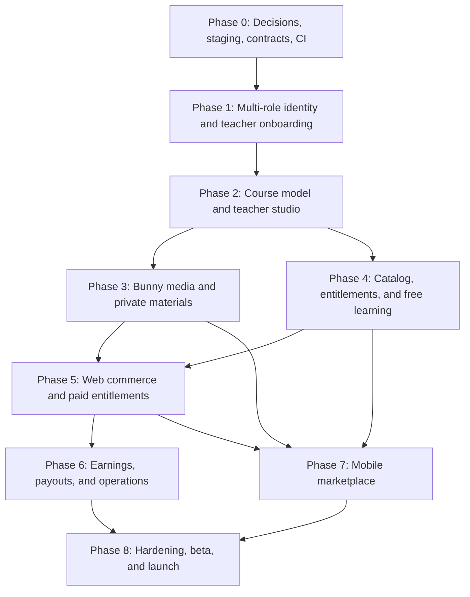

# JapanGoLearn SaaS Multi-Agent Implementation Plan

> **Superseded on 2026-07-22.** The current canonical roadmap is `docs/saas-implementation-plan.md`. Retain this file only as historical planning context; do not use its agent assignments.

Status: canonical implementation plan  
Last updated: 2026-07-22  
Repository: `bhupendra1612/japangolearn`  
Team model: one human owner, one coordinating AI agent, and three implementation AI agents  
Chosen video provider: Bunny Stream

## 1. Purpose

This document is the source of truth for turning JapanGoLearn into a teacher-led course marketplace without allowing independent AI agents to create incompatible schemas, APIs, or user experiences.

It defines:

- approved and pending business decisions;
- the target architecture;
- phase dependencies and safe parallel work;
- permanent responsibility lanes for three implementation agents;
- task, branch, migration, review, and handoff rules;
- phase deliverables, validation commands, and exit gates;
- actions that require the human owner or coordinating agent.

Agents must read this document, `docs/p0-engineering.md`, and `docs/database-security-audit.md` before starting a marketplace task.

Time estimates are planning aids, not release promises. Progress is controlled by exit gates, not by elapsed time.

## 2. Current repository baseline

JapanGoLearn currently has:

- `apps/web` for the marketing website and learner dashboard;
- `apps/admin` for staff administration;
- `apps/mobile` for the Expo learner app;
- shared `core`, `database`, `content`, `config`, and `ui` packages;
- Supabase Auth, migrations, generated types, RLS, and database security audits;
- learning attempts, XP, mastery, activities, and progress foundations;
- unit, type, integration, E2E, accessibility, backup/restore, and production schema-drift checks;
- Cloudflare production deployment for web and admin;
- feature flags for AI, premium, and unfinished JLPT content.

Known Phase 0 gaps:

- there is no isolated staging Supabase project or staging Cloudflare deployment;
- production deploys automatically from `main`, before a separate staging promotion gate;
- `.env.example` and shared database constants reference the production Supabase project;
- a missing environment value can therefore connect a non-production build to production;
- there is no shared `apps/api` service or `apps/teacher` studio;
- `profiles.role` supports one scalar role and cannot represent student plus teacher;
- the API error conventions are only partially represented by `packages/core/src/result.ts`;
- provider interfaces do not exist;
- marketplace feature flags do not exist;
- `pnpm lint` succeeds with 30 mobile warnings rather than zero warnings.

## 3. Business decision register

AI agents may use decisions marked **accepted**. A **provisional** decision is a working default for design and local code, but it must be approved by the owner before paid production behavior is enabled. An **owner gate** blocks the dependent phase.

| Decision             | Working decision                                                                                                   | Status                | Gate                                                                     |
| -------------------- | ------------------------------------------------------------------------------------------------------------------ | --------------------- | ------------------------------------------------------------------------ |
| Video provider       | Bunny Stream                                                                                                       | Accepted              | Bunny staging and production libraries still require owner account setup |
| Video upload         | Server-signed Bunny TUS direct/resumable upload                                                                    | Accepted architecture | Phase 3                                                                  |
| Protected playback   | Short-lived Bunny playback token after server entitlement check                                                    | Accepted architecture | Phase 3                                                                  |
| Course materials     | Private Cloudflare R2 objects through signed access                                                                | Provisional           | Phase 3                                                                  |
| Purchase model       | One-time course purchases only for MVP                                                                             | Provisional           | Phase 5                                                                  |
| Payment collector    | A registered JapanGoLearn legal entity uses the platform payment account                                           | Provisional           | Legal entity name is an owner gate for Phase 5                           |
| Seller of record     | JapanGoLearn is seller of record for the MVP                                                                       | Provisional           | Accountant/legal confirmation is an owner gate for Phase 5               |
| Initial market       | India-first web beta                                                                                               | Provisional           | Phase 5                                                                  |
| Initial web currency | INR only in UI; schema supports ISO multi-currency from day one                                                    | Provisional           | Phase 5                                                                  |
| Refund policy        | Seven days and no more than 20% course completion, with admin override for defective or misrepresented content     | Provisional           | Legal review before Phase 5 release                                      |
| Course access        | No fixed expiry while the platform and course remain available; revocable for refund, fraud, or policy enforcement | Provisional           | Terms approval before Phase 5 release                                    |
| Platform commission  | 20% of defined net course revenue; snapshot the rule on each order item                                            | Provisional           | Owner approval before Phase 5 schema freeze                              |
| Teacher payouts      | Monthly, 30-day earning hold, minimum INR 1,000 payout balance                                                     | Provisional           | Owner/payment-provider approval before Phase 6                           |
| Teacher age          | 18 years or older                                                                                                  | Provisional           | Legal review before teacher beta                                         |
| Student age          | 18 years or older during closed beta to avoid child-consent handling in MVP                                        | Provisional           | Owner/legal review before public launch                                  |
| Localizations        | BCP-47 locale rows, initially `en` and `hi`; Japanese is taught content, not a UI locale column                    | Accepted architecture | Phase 2                                                                  |
| Payment provider     | Not selected                                                                                                       | Pending owner gate    | Blocks Phase 5 provider implementation                                   |
| Tax/invoice model    | Not selected                                                                                                       | Pending owner gate    | Blocks Phase 5 production release                                        |

The owner may change a provisional decision by updating this table and adding an ADR before dependent contracts or migrations are merged. Agents must not silently choose a different value.

## 4. Target architecture

```text
apps/web       Marketing website, catalog, checkout, and student dashboard
apps/admin     Teacher review, moderation, support, refunds, finance, and audit
apps/teacher   Teacher profile, course builder, media, earnings, and analytics
apps/mobile    Student app and later teacher companion mode
apps/api       Shared /api/v1 service, provider calls, webhooks, and authorization

packages/api-contracts   Request/response schemas, DTOs, error codes
packages/providers       Narrow provider interfaces and test fakes
packages/database        Generated Supabase types and repositories
packages/core            Domain primitives, events, feature flags, shared Result
packages/ui              Shared presentation components

Supabase       Auth, Postgres, RLS, metadata, progress, ledgers, and audit
Bunny Stream  Video ingestion, transcoding, captions, thumbnails, and playback
Cloudflare R2 Private study materials and optional source archive
Cloudflare    Runtime and deployment for web/admin/teacher/API
Expo          iOS and Android application delivery
```

### 4.1 Domain boundaries

| Domain                     | Owns                                                                         | Must not own                                |
| -------------------------- | ---------------------------------------------------------------------------- | ------------------------------------------- |
| Identity and authorization | profiles, roles, permissions, role grants, consent                           | teacher review lifecycle                    |
| Teacher onboarding         | applications, qualifications, public teacher profile, review state           | courses, orders, payouts                    |
| Catalog and authoring      | courses, immutable revisions, localizations, sections, lessons               | Bunny credentials, entitlement decisions    |
| Media                      | provider-neutral asset records, upload state, webhook inbox, playback grants | course structure, orders                    |
| Learning access            | enrollments, entitlements, progress, bookmarks, notes                        | provider payment transactions               |
| Commerce                   | products, prices, orders, payments, refunds, payment webhooks                | teacher balance mutation outside the ledger |
| Earnings and payouts       | commission snapshots, earning ledger, payout batches                         | payment authorization                       |
| Moderation and support     | reviews, reports, disputes, support cases, admin audit                       | authentication source of truth              |
| Notifications              | preferences, devices, outbox, deliveries                                     | primary business decision logic             |

### 4.2 Critical dependency graph



Phase 3 and Phase 4 may run in parallel after Phase 2 contracts are frozen. Documentation, legal preparation, notification templates, accessibility work, and UI prototypes may overlap earlier phases. Database schema, generated types, financial ledgers, authorization rules, and shared contracts must not be developed independently by multiple agents.

## 5. Four-part team model

The coordinating agent and three implementation agents use persistent lanes to reduce conflict.

| Lane                             | Primary ownership                                                                                                        | Must avoid                                                       |
| -------------------------------- | ------------------------------------------------------------------------------------------------------------------------ | ---------------------------------------------------------------- |
| Coordinator                      | decisions, ADRs, task packets, shared contracts, file reservations, integration, releases, staging/production operations | starting broad implementation while agents own overlapping files |
| Agent A — Data and security      | migrations, grants, RLS, repositories, generated types, DB tests, security audit                                         | UI, Bunny/payment SDKs, deployment secrets                       |
| Agent B — API and integrations   | `apps/api`, provider ports, Bunny/payment/notification adapters, webhook handling, Cloudflare runtime code               | migrations unless explicitly allocated, UI redesign              |
| Agent C — Experience and quality | web/admin/teacher/mobile UI, accessibility, fixtures, E2E, lint cleanup                                                  | migrations, provider credentials, independent API shapes         |

Only the coordinator may merge cross-cutting changes, apply staging or production migrations, change production secrets, enable production feature flags, or deploy production.

## 6. Multi-agent operating protocol

### 6.1 Branches and worktrees

Every agent uses a separate worktree created from current `origin/main`.

```text
Branch:   agent/<phase>-<workstream>
Worktree: ../japangolearn-wt-<lane>-<workstream>
```

Examples:

```text
agent/p0-api-contracts
agent/p1-role-schema
agent/p2-teacher-studio
agent/p3-bunny-media
```

Rules:

- one branch, worktree, bounded task, and draft PR per agent task;
- no shared worktree between agents;
- no force-push to a branch used by another agent;
- no unrelated cleanup or dependency upgrade in a feature PR;
- rebase or merge current `main` before handoff;
- only the coordinator merges agent PRs.

### 6.2 Shared-file reservations

The coordinator assigns an exclusive owner before any agent edits these hotspots:

```text
supabase/migrations/
packages/database/src/supabase.types.ts
packages/core/src/feature-flags.ts
packages/core/src/analytics.ts
packages/api-contracts/
packages/providers/
package.json files
pnpm-lock.yaml
turbo.json
.env.example
.github/workflows/
wrangler configuration
```

Only one agent may edit the lockfile or generate Supabase types in a parallel batch. Generated files are never hand-edited.

### 6.3 Migration allocation

Only Agent A may own an active migration task unless the coordinator explicitly reallocates it.

1. Reserve the migration in the phase status table.
2. Create it with `pnpm exec supabase migration new <descriptive_name>`.
3. Never invent a timestamp manually.
4. Never edit a migration already applied to staging or production; add a corrective migration.
5. Add explicit grants/revokes as well as RLS.
6. Add positive and negative authorization tests.
7. Run a clean local database replay and security audit.
8. Regenerate types once after the schema batch is final.
9. Merge schema/types before dependent API and UI integration.
10. Agents never apply migrations to production.

### 6.4 Contract-first rule

Before parallel backend and UI implementation, merge a small contract task defining:

- resource names and state machines;
- request and response schemas;
- stable error codes;
- provider interface methods;
- feature-flag keys;
- analytics, domain-event, and audit names;
- loading, empty, error, forbidden, and suspended behavior.

UI work may use typed fixtures behind the approved contract. UI agents must not invent a second backend shape.

### 6.5 Required task packet

The coordinator must give every agent this information:

```md
## Task

ID:
Phase:
Lane:
Branch:
Depends on:

### Objective

One measurable result.

### Approved decisions

- ...

### In scope

- ...

### Out of scope

- ...

### Owned files

- ...

### Reserved/shared files

- ...

### Database allocation

Migration allowed: yes/no
Generated types owner: lane or none
Required RLS tests: ...

### Acceptance criteria

- ...

### Required checks

- command

### Stop conditions

- missing owner decision
- secret/vendor access required
- production mutation required
- breaking a frozen contract
```

### 6.6 Required handoff

An agent handoff is incomplete unless it includes:

```md
## Result

Completed or blocked.

## Commits and PR

Identifiers and links.

## Files changed

Important files only.

## Contract/schema impact

What downstream agents must know.

## Verification

Exact commands and outcomes.

## Environment work

Variable/resource names only, never secret values.

## Remaining risks

Known limitations and follow-up work.

## Recommended integration order

What merges before and after this branch.
```

### 6.7 Stop and escalate conditions

An implementation agent must stop when work requires:

- choosing or changing seller-of-record, currency, commission, refund, payout, age, tax, KYC, copyright, or app-store rules;
- creating a paid external resource or accepting vendor terms;
- Bunny, Supabase, Cloudflare, payment, Apple, or Google credentials;
- staging or production schema mutations;
- destructive or irreversible operations;
- a breaking contract change affecting another active task;
- editing a file reserved by another agent;
- material scope expansion.

Secrets are entered by the owner in vendor or CI secret stores. They never appear in chat, commits, screenshots, logs, or example environment files.

## 7. Phase 0 — Decisions, environments, contracts, and quality foundation

Estimated size: 1–2 coordinated AI waves  
Hard dependencies: none  
External owner work: staging accounts/resources and business approvals

### 7.1 Phase 0 parallel work allocation

| Task    | Owner               | Work                                                                               | Dependencies                                  |
| ------- | ------------------- | ---------------------------------------------------------------------------------- | --------------------------------------------- |
| P0-C01  | Coordinator         | Accept or revise provisional decisions and create ADR index                        | None                                          |
| P0-A01  | Agent A             | Environment safety design, marketplace role/RLS matrix, schema-change protocol     | P0-C01 for business-sensitive assumptions     |
| P0-B01  | Agent B             | Scaffold API/provider contract packages and fakes; define `/api/v1` envelope       | None                                          |
| P0-CX01 | Agent C             | Fix all 30 mobile warnings and prepare zero-warning lint enforcement               | None                                          |
| P0-CX02 | Agent C             | Add marketplace feature flags, all default off                                     | P0-B01 contract names frozen                  |
| P0-C02  | Coordinator         | Integrate shared contracts, reserve shared files, update CI                        | P0-A01, P0-B01, P0-CX01                       |
| P0-E01  | Coordinator + owner | Create isolated staging Supabase, Cloudflare, Bunny, and GitHub environments       | Owner credentials required                    |
| P0-E02  | Agent B             | Add staging Worker/API configurations and deployment workflow                      | P0-E01 resource identifiers, no secret values |
| P0-E03  | Agent A             | Add build-time environment isolation checks and staging schema verification        | P0-E01 staging project ref                    |
| P0-CX03 | Agent C             | Verify web/admin/mobile clients fail safely when environment variables are missing | P0-E03                                        |
| P0-V01  | Coordinator         | Full integration validation and staging smoke test                                 | All Phase 0 tasks                             |

### 7.2 Required ADRs

Create `docs/adr/` and add one short record per decision:

```text
0001-marketplace-business-model.md
0002-currency-refunds-access.md
0003-commission-and-payouts.md
0004-age-and-consent.md
0005-course-localization.md
0006-bunny-stream-video.md
0007-api-topology.md
0008-environment-and-secrets.md
0009-authorization-and-audit.md
```

Each ADR records status, context, decision, consequences, alternatives, owner approval, and revision date.

### 7.3 Environment isolation target

| Environment | Supabase                                | Cloudflare                       | Bunny                            | Payment       | Data                     |
| ----------- | --------------------------------------- | -------------------------------- | -------------------------------- | ------------- | ------------------------ |
| Local       | Local CLI stack                         | Local dev                        | Fake provider by default         | Fake provider | Seed/test only           |
| PR preview  | Staging-only credentials or local/fakes | Unique preview URL               | Staging library only when needed | Sandbox only  | Disposable/test          |
| Staging     | Dedicated staging project               | Dedicated staging Workers/routes | Dedicated staging library        | Sandbox       | Synthetic/non-production |
| Production  | Existing project `teylstfbjtutssnfmhhu` | Production Workers/domains       | Dedicated production library     | Live account  | Real user data           |

Required changes:

- remove hardcoded production Supabase fallbacks from shared runtime code;
- replace production values in `.env.example` with placeholders;
- add an environment-validation module used by web, admin, API, teacher, and mobile;
- fail a preview/staging build if its Supabase URL contains production ref `teylstfbjtutssnfmhhu`;
- keep PR CI on local Supabase or safe placeholders;
- create GitHub `staging` and `production` environments with distinct secrets;
- deploy `main` to staging first;
- promote to production through a manual release workflow after staging verification;
- use different Worker names and routes for staging;
- use separate Bunny libraries and keys for staging and production;
- never copy production user data into staging.

Suggested staging names:

```text
Supabase:  japangolearn-staging
Workers:   japangolearn-web-staging
           japangolearn-admin-staging
           japangolearn-api-staging
           japangolearn-teacher-staging
Bunny:     japangolearn-staging
```

### 7.4 Server-only environment names

Document names but never values:

```text
SUPABASE_SERVICE_ROLE_KEY
BUNNY_STREAM_LIBRARY_ID
BUNNY_STREAM_API_KEY
BUNNY_STREAM_WEBHOOK_SIGNING_KEY
BUNNY_STREAM_TOKEN_AUTH_KEY
BUNNY_STREAM_CDN_HOSTNAME
R2_ACCOUNT_ID
R2_ACCESS_KEY_ID
R2_SECRET_ACCESS_KEY
R2_BUCKET_NAME
```

No `BUNNY_*`, service-role, R2 secret, or future payment secret may use a `NEXT_PUBLIC_` or `EXPO_PUBLIC_` prefix.

### 7.5 `/api/v1` convention

Success:

```json
{
  "data": {},
  "meta": {
    "requestId": "uuid"
  }
}
```

Failure:

```json
{
  "error": {
    "code": "COURSE_NOT_FOUND",
    "message": "Course not found",
    "requestId": "uuid",
    "details": {}
  }
}
```

Rules:

- resource URLs live under `/api/v1`;
- JSON uses UTF-8;
- timestamps are UTC ISO-8601;
- IDs are UUIDs unless an existing content table requires another type;
- money is integer minor units plus ISO currency;
- growing collections use cursor pagination;
- request/response schemas are shared and runtime validated;
- authentication is normalized by the API adapter;
- `Idempotency-Key` is required for upload sessions, checkout, refunds, grants, and other retry-sensitive commands;
- logs and responses carry a request ID;
- provider/Supabase errors are mapped to stable application codes and never returned raw;
- validation details contain safe field errors, never credentials or internal SQL;
- authentication, upload-session, playback-grant, and commerce endpoints are rate limited;
- compatibility changes are additive inside v1; breaking changes require v2.

Initial HTTP mapping:

| Error category                | HTTP status |
| ----------------------------- | ----------- |
| validation                    | 400         |
| unauthenticated               | 401         |
| forbidden/suspended           | 403         |
| not found                     | 404         |
| conflict/idempotency mismatch | 409         |
| rate limited                  | 429         |
| provider unavailable          | 502 or 503  |
| unexpected server failure     | 500         |

### 7.6 Provider ports

Provider-neutral call sites must not expose Bunny-specific or future payment-specific fields.

```ts
interface VideoProvider {
  createUpload(input: CreateVideoUploadInput): Promise<VideoUploadSession>;
  getAsset(providerAssetId: string): Promise<ProviderVideoAsset>;
  deleteAsset(providerAssetId: string): Promise<void>;
  createPlaybackGrant(input: PlaybackGrantInput): Promise<PlaybackGrant>;
  verifyWebhook(input: RawWebhookInput): Promise<VerifiedVideoEvent>;
}

interface PaymentProvider {
  createCheckout(input: CreateCheckoutInput): Promise<CheckoutSession>;
  refund(input: RefundInput): Promise<RefundResult>;
  verifyWebhook(input: RawWebhookInput): Promise<VerifiedPaymentEvent>;
}

interface NotificationProvider {
  sendEmail(input: EmailMessage): Promise<DeliveryResult>;
  sendPush(input: PushMessage): Promise<DeliveryResult>;
}
```

Phase 0 includes fakes and contract tests, not live payment integration. Bunny implementation begins in Phase 3.

### 7.7 Feature flags

Add these shared keys, all disabled by default:

```text
teacherOnboarding
teacherStudio
courseCatalog
bunnyUploads
securePlayback
freeEnrollment
commerceWeb
teacherEarnings
teacherPayouts
mobilePurchases
teacherMobileMode
```

Classify each flag as:

- server kill switch;
- public client visibility flag;
- allowlist or percentage rollout where needed.

A client-visible flag hides UI only. It is never an authorization boundary.

### 7.8 Audit and event standards

Use lower-case past-tense names:

```text
domain.entity.action
```

Examples:

```text
teacher.application.submitted
teacher.application.approved
teacher.account.suspended
course.revision.submitted
course.revision.published
media.asset.upload_started
media.asset.ready
commerce.order.paid
commerce.refund.completed
entitlement.access.granted
entitlement.access.revoked
payout.batch.completed
notification.delivery.failed
```

Separate three concerns:

- analytics events measure product behavior and may be lossy;
- domain/outbox events drive workflows;
- audit logs prove privileged or security-sensitive actions.

Never put all three in one table.

Audit minimum fields:

```text
id
occurred_at
actor_user_id
actor_roles_snapshot
action
target_type
target_id
outcome
reason_code
request_id
before_state
after_state
metadata
```

Audit records are append-only and server-written. Redact PII, tokens, keys, bank/card data, and raw sensitive documents.

### 7.9 Phase 0 exit gate

- [ ] Accepted/provisional decisions are recorded in ADRs.
- [ ] Payment, tax, and legal owner gates remain visibly blocked rather than guessed.
- [ ] Dedicated staging Supabase project exists.
- [ ] Dedicated staging Cloudflare workers/routes exist.
- [ ] Dedicated staging Bunny library exists.
- [ ] GitHub staging and production secrets are separate.
- [ ] Preview and staging builds cannot use production Supabase ref.
- [ ] Production deploy is a manual promotion after staging verification.
- [ ] `/api/v1` contracts and provider fakes have tests.
- [ ] All marketplace feature flags default off.
- [ ] `pnpm lint` reports zero warnings.
- [ ] CI fails on any ESLint warning.
- [ ] No production or provider secret is present in preview configuration.
- [ ] Current full CI remains green.

## 8. Phase 1 — Multi-role identity and teacher onboarding

Estimated size: 2–3 coordinated AI waves  
Hard dependency: Phase 0 exit gate

### Parallel allocation

| Agent A — Data/security                                                                                                                    | Agent B — API/integrations                                                               | Agent C — Experience/quality                                                                                  |
| ------------------------------------------------------------------------------------------------------------------------------------------ | ---------------------------------------------------------------------------------------- | ------------------------------------------------------------------------------------------------------------- |
| Add `user_roles`, teacher profile/application/review/status, consent, and audit schema; backfill current users/admins; RLS and role matrix | Add shared auth/permission middleware and atomic application review/role-grant endpoints | Build separate student/teacher registration intent, teacher application UI, admin review UI, and E2E fixtures |

Migration strategy:

1. Add `user_roles` without removing `profiles.role`.
2. Backfill every existing account as `student`.
3. Backfill current admins as `admin`.
4. Add permission-oriented database helpers.
5. Move policies and apps away from `profiles.role`.
6. Retain the old column for compatibility until every consumer is migrated.
7. Remove it only in a later corrective phase.

Initial roles:

```text
student
teacher
admin
support
finance
content_reviewer
```

Teacher lifecycle:

```text
draft -> submitted -> under_review -> changes_requested -> submitted
                                 \-> approved
                                 \-> rejected
approved -> suspended -> approved
```

Teacher verification documents stay in a private Supabase Storage bucket initially, never Bunny and never public URLs.

### Exit gate

- [ ] One identity can hold both student and teacher roles.
- [ ] No user can grant themselves teacher or staff roles.
- [ ] Approved, rejected, changes-requested, and suspended flows are tested.
- [ ] Existing admin access works after the compatibility migration.
- [ ] Public users see only approved teacher profiles.
- [ ] Qualification documents are private.
- [ ] Every review and role change creates an immutable audit record.
- [ ] Cross-user and cross-role denial tests pass.

## 9. Phase 2 — Course model, localization, moderation, and teacher studio

Estimated size: 3 coordinated AI waves  
Hard dependency: approved teacher authorization from Phase 1

### Parallel allocation

| Agent A — Data/security                                                                                         | Agent B — API/integrations                                                           | Agent C — Experience/quality                                                                          |
| --------------------------------------------------------------------------------------------------------------- | ------------------------------------------------------------------------------------ | ----------------------------------------------------------------------------------------------------- |
| Add courses, immutable revisions, localization rows, sections, lessons, moderation submissions/reviews, and RLS | Add course authoring, revision, preview, submission, moderation, and publishing APIs | Add `apps/teacher`, course builder, autosave, preview, submission UI, and admin moderation experience |

Core tables:

```text
courses
course_revisions
course_revision_localizations
course_sections
lessons
course_categories
course_category_assignments
course_submission_reviews
```

Use a stable course root and immutable/snapshotted revisions. Never destructively edit currently published content.

Localization rules:

- use BCP-47 locale rows, initially `en` and `hi`;
- `ja` describes the taught language/content where appropriate;
- every revision has a `primary_locale`;
- requested locale falls back deterministically to the primary locale;
- require at least one complete locale before submission;
- never add parallel columns such as `title_en` and `title_hi`.

### Exit gate

- [ ] Approved teacher can create, localize, preview, and submit a draft.
- [ ] Teacher cannot edit or read another teacher's draft.
- [ ] Submitted/published revision cannot be destructively changed.
- [ ] Reviewer can request changes, approve, publish, or reject with audit history.
- [ ] Suspended teacher cannot create or submit revisions.
- [ ] Published catalog metadata has safe public read policies.

## 10. Phase 3 — Bunny video pipeline and private study materials

Estimated size: 2–3 coordinated AI waves  
Hard dependency: Phase 2 course/media contracts  
May run in parallel with Phase 4 after contract freeze

### Parallel allocation

| Agent A — Data/security                                                                                          | Agent B — API/integrations                                                                                                                               | Agent C — Experience/quality                                                                                                   |
| ---------------------------------------------------------------------------------------------------------------- | -------------------------------------------------------------------------------------------------------------------------------------------------------- | ------------------------------------------------------------------------------------------------------------------------------ |
| Add provider-neutral media records, lesson attachments, study materials, webhook inbox, quotas, RLS, and indexes | Implement Bunny TUS signing, video creation, signed webhook verification, status mapping, playback tokens, R2 signed material access, and provider fakes | Build resumable teacher upload UI, status/error/retry states, lesson attachment UI, captions UI, and secure web/mobile players |

Media minimum fields:

```text
provider
provider_asset_id
owner_user_id
kind
status
duration_seconds
width
height
source_filename
mime_type
size_bytes
caption_status
error_code
created_at
ready_at
deleted_at
```

Use unique `(provider, provider_asset_id)`. Never store signed playback URLs or provider keys.

Bunny workflow:

1. Authenticate an approved, non-suspended teacher.
2. Verify course ownership, file type, duration/size limits, and quota.
3. Create a local media record in `created` state.
4. Create the Bunny video object server-side.
5. Generate a short-lived server-side SHA-256 TUS authorization signature.
6. Upload directly from the client to Bunny without exposing the API key.
7. Validate Bunny `v1` webhook HMAC over the exact raw body using a constant-time comparison.
8. Insert webhook events idempotently and tolerate duplicate/out-of-order delivery.
9. Map provider status to the internal state machine.
10. Allow attachment/publication only when the internal status is `ready`.
11. Generate short-lived playback grants only after preview/entitlement authorization.

Primary references:

- [Bunny TUS resumable uploads](https://docs.bunny.net/stream/tus-resumable-uploads)
- [Bunny Stream webhooks](https://docs.bunny.net/stream/webhooks)
- [Bunny playback token authentication](https://docs.bunny.net/stream/token-authentication)

### Exit gate

- [ ] Large upload resumes after network interruption.
- [ ] Bunny keys never enter client bundles, logs, or responses.
- [ ] Invalid webhook signature is rejected.
- [ ] Duplicate and out-of-order webhook events are harmless.
- [ ] Teacher cannot see or attach another teacher's asset.
- [ ] Paid/private video cannot play without a server grant.
- [ ] Captions/transcript requirements block paid publication when incomplete.
- [ ] R2 material access is private and short-lived.

## 11. Phase 4 — Catalog, entitlement core, enrollment, and free learning

Estimated size: 2 coordinated AI waves  
Hard dependency: Phase 2 published course contract  
Secure video portions depend on Phase 3

### Parallel allocation

| Agent A — Data/security                                                                    | Agent B — API/integrations                                                                                       | Agent C — Experience/quality                                                                                                  |
| ------------------------------------------------------------------------------------------ | ---------------------------------------------------------------------------------------------------------------- | ----------------------------------------------------------------------------------------------------------------------------- |
| Add enrollments, entitlements/events, progress, notes, bookmarks, reviews/reports, and RLS | Add catalog search/filter, free enrollment, entitlement authorization, playback authorization, and progress APIs | Build SEO catalog, teacher/course pages, student library, continue-learning, player, notes/bookmarks, and free mobile catalog |

The entitlement is the authorization source of truth. Enrollment represents the learner's course relationship. Free access still creates an idempotent entitlement with source `free_course`.

Supported sources from day one:

```text
free_course
web_purchase
apple_purchase
google_purchase
admin_grant
promotion
```

Never authorize paid playback from `orders.status` or `enrollments` alone.

### Exit gate

- [ ] Free enrollment creates exactly one entitlement.
- [ ] Preview lessons work without accidentally granting full access.
- [ ] Revoked or expired entitlement blocks protected playback.
- [ ] Progress resumes across web and mobile.
- [ ] Notes, bookmarks, progress, and library rows deny cross-user access.
- [ ] Public catalog shows only published courses and approved teachers.

## 12. Phase 5 — Web commerce and paid entitlements

Estimated size: 3 coordinated AI waves  
Hard dependencies: Phase 4 entitlement core, Phase 3 playback, approved merchant/payment/currency/refund/tax decisions

### Owner gates before work

- legal entity and payment account;
- seller-of-record confirmation;
- payment provider and sandbox credentials;
- INR/refund/access policy approval;
- tax and invoice requirements;
- commission definition approval.

### Parallel allocation

| Agent A — Data/security                                                                                                                              | Agent B — API/integrations                                                                                                                  | Agent C — Experience/quality                                                                              |
| ---------------------------------------------------------------------------------------------------------------------------------------------------- | ------------------------------------------------------------------------------------------------------------------------------------------- | --------------------------------------------------------------------------------------------------------- |
| Add products, prices, immutable orders/items, attempts, transactions, refunds, webhook inbox, coupons, tax docs, and atomic entitlement finalization | Implement payment adapter, checkout, signature verification, idempotent/replayable webhooks, refund API, reconciliation, and provider fakes | Build checkout, success/failure, purchase history, invoice, admin order/refund UI, and commerce E2E tests |

Financial rules:

- use integer minor units, never floating point;
- snapshot price, currency, tax, discount, and commission inputs on the order item;
- require unique provider event IDs;
- finalize payment and entitlement atomically;
- keep the finalization function server-only, fixed-search-path, and unavailable to `PUBLIC`, `anon`, and client `authenticated` roles;
- use compensating refund/chargeback records rather than rewriting history.

### Exit gate

- [ ] Successful payment creates exactly one paid entitlement.
- [ ] Duplicate/out-of-order webhooks cannot duplicate money or access.
- [ ] Failed/cancelled checkout grants nothing.
- [ ] Refund and chargeback behavior matches the approved ADR.
- [ ] Students see only their own orders and safe invoice data.
- [ ] Reconciliation invariant tests pass.
- [ ] Commerce remains disabled by default in production.

## 13. Phase 6 — Teacher earnings, payouts, moderation, and operations

Estimated size: 2 coordinated AI waves  
Hard dependency: immutable Phase 5 commerce ledger

### Parallel allocation

| Agent A — Data/security                                                                                         | Agent B — API/integrations                                                                                           | Agent C — Experience/quality                                                                             |
| --------------------------------------------------------------------------------------------------------------- | -------------------------------------------------------------------------------------------------------------------- | -------------------------------------------------------------------------------------------------------- |
| Add commission rules, earning ledger, payout accounts/batches/items/adjustments, disputes, cases, and staff RLS | Add earnings calculation, payout hold, manual payout, finance export, support override, audit, and notification APIs | Build teacher earnings/statements, admin finance/support/moderation dashboards, and permission E2E tests |

Rules:

- snapshot the commission rule on every paid order item;
- earnings are append-only;
- refunds/chargebacks create negative or compensating entries;
- store provider references and masked payout data, never raw bank/card credentials;
- distinguish reviewer, support, finance, and full-admin permissions;
- begin with manual payout approval, not automated payouts.

### Exit gate

- [ ] Every payment reconciles to order, entitlement, and teacher earning entries.
- [ ] Refund adjusts earnings correctly.
- [ ] Holding period prevents premature payout.
- [ ] Support/reviewer roles cannot perform finance actions.
- [ ] Every refund, override, moderation, and payout action is audited.
- [ ] Finance can export and reproduce a payout calculation.

## 14. Phase 7 — Notifications and mobile marketplace

Estimated size: 3 coordinated AI waves  
Hard dependencies: Phases 3–5; teacher companion portions depend on Phases 1–2

### Parallel allocation

| Agent A — Data/security                                                                                              | Agent B — API/integrations                                                                                              | Agent C — Experience/quality                                                                                    |
| -------------------------------------------------------------------------------------------------------------------- | ----------------------------------------------------------------------------------------------------------------------- | --------------------------------------------------------------------------------------------------------------- |
| Add preferences, devices, notification/outbox/delivery records, store event IDs, receipt/entitlement events, and RLS | Add async email/push delivery, Apple/Google receipt adapters, server verification, restore, revocation, and idempotency | Build student mobile catalog/player/progress/purchase/restore and teacher companion profile/status/analytics UI |

Business transactions insert outbox events atomically. Delivery workers process them asynchronously. Never send email or push inside a payment transaction.

Mobile clients never decide whether a receipt or entitlement is valid. Store products map to the same internal entitlement model used by web purchases.

Owner gates:

- Apple Developer and Google Play Console accounts;
- store agreements, banking/tax setup, product IDs, and sandbox testers;
- current regional app-store payment-policy review.

### Exit gate

- [ ] Notification preferences and retry behavior work.
- [ ] Duplicate delivery attempts are safe.
- [ ] Invalid push tokens are disabled.
- [ ] Apple/Google purchase and restore grant the correct internal entitlement.
- [ ] Refund/revocation removes access consistently across web and mobile.
- [ ] Teacher companion cannot bypass web-studio permissions.
- [ ] Real iOS and Android device tests pass.

## 15. Phase 8 — Hardening, controlled beta, and launch

Estimated size: 2 coordinated AI waves plus real beta observation  
Hard dependency: all launch-scope phases

### Parallel allocation

| Agent A — Data/security                                                                                         | Agent B — API/integrations                                                                                 | Agent C — Experience/quality                                                                                        |
| --------------------------------------------------------------------------------------------------------------- | ---------------------------------------------------------------------------------------------------------- | ------------------------------------------------------------------------------------------------------------------- |
| RLS penetration matrix, advisors, account deletion/export, consent retention, restore drill, finance invariants | Rate/load tests, webhook replay tests, observability, quotas/cost alerts, media recovery, rollback tooling | Accessibility, captions, localization, legal/support surfaces, abuse/reporting, complete E2E, mobile release checks |

Coordinator and owner run a controlled beta with 5–10 approved teachers before public launch.

### Exit gate

- [ ] Account deletion and export are verified.
- [ ] Age/consent, teacher agreement, privacy, refund, copyright, and takedown policies are published.
- [ ] Abuse reporting, blocking, disputes, and support procedures work.
- [ ] Catalog, upload grant, playback grant, checkout, and webhook load tests pass.
- [ ] Database and media recovery drills are recorded.
- [ ] Cost and quota alerts exist for Bunny, R2, Supabase, and Cloudflare.
- [ ] Accessibility and caption audit passes.
- [ ] Finance reconciliation drill passes.
- [ ] Staging-to-production rollback drill passes.
- [ ] Beta feedback has no unresolved launch-blocking issue.
- [ ] Owner explicitly authorizes production feature enablement.

## 16. Post-launch phases

Do not start these until the core marketplace is stable:

- subscriptions or memberships;
- live classes and cohorts;
- institutes/organizations and teacher teams;
- affiliates and referral commissions;
- offline paid-video downloads;
- advanced certificates;
- AI course generation;
- enterprise DRM;
- automated teacher payouts;
- complex multi-currency settlement.

## 17. Safe parallelization matrix

Good parallel batches after contracts are merged:

| Agent A            | Agent B                     | Agent C                    |
| ------------------ | --------------------------- | -------------------------- |
| Schema/RLS         | API against approved schema | UI with typed fixtures     |
| Media metadata/RLS | Bunny webhook adapter       | Upload/player UI           |
| Entitlement schema | Access API                  | Catalog/student UI         |
| Commerce ledger    | Payment adapter/webhooks    | Checkout/admin UI          |
| Earnings ledger    | Payout/notification API     | Finance/teacher dashboards |

Work must stay sequential when it changes:

- the same migration series;
- generated database types;
- the same shared API contract;
- authorization/permission rules;
- root manifests or lockfile;
- deployment/secrets configuration;
- payment, entitlement, or payout ledger semantics.

Preferred integration order for every phase:

```text
Decision/ADR
-> contract
-> schema, grants, and RLS
-> generated types and repositories
-> API/provider implementation
-> web/admin/teacher/mobile consumers
-> integration and E2E tests
-> staging deployment
-> feature-flagged production release
```

## 18. Universal definition of done

No task or phase is complete until all applicable items pass:

- ADR and contract documentation are current.
- Scope matches the assigned task packet.
- Migration replays from an empty local database.
- New exposed tables have explicit grants/revokes and RLS.
- Generated Supabase types are current.
- Security audit includes new protected resources.
- Positive and negative role tests exist.
- API contract, validation, authorization, and idempotency tests pass.
- Lint reports zero warnings.
- Typecheck and affected builds pass.
- Provider/service-role keys are absent from client bundles and logs.
- Staging deploy uses staging-only secrets.
- Logs contain request IDs and redact sensitive data.
- Feature can be disabled without deleting data.
- Rollout, rollback, and recovery steps are documented.
- Coordinator verifies the exit gate before dependent tasks begin.

### Repository-wide integration commands

Run the relevant subset on agent branches. Run the complete set before a phase is accepted:

```powershell
pnpm format:check
pnpm lint
pnpm typecheck
pnpm test:unit
pnpm test:typecheck
pnpm build:web
pnpm build:admin
pnpm check:mobile
pnpm check:expo
pnpm exec supabase start
pnpm exec supabase db reset
pnpm db:types:check:local
pnpm db:security:audit
pnpm db:backup:verify
pnpm test:integration
pnpm test:e2e
pnpm exec supabase stop
```

Add `build:api`, `build:teacher`, and their checks to this gate when those apps are created.

## 19. Phase status tracker

The coordinator owns this table. Implementation agents report status in handoffs rather than editing it concurrently.

| Phase   | Status  | Exit gate                              | Notes                                             |
| ------- | ------- | -------------------------------------- | ------------------------------------------------- |
| Phase 0 | Planned | Not started                            | Bunny decision accepted; other owner gates remain |
| Phase 1 | Blocked | Phase 0                                | Multi-role identity                               |
| Phase 2 | Blocked | Phase 1                                | Course and teacher studio                         |
| Phase 3 | Blocked | Phase 2                                | Bunny media and R2 materials                      |
| Phase 4 | Blocked | Phase 2; secure portions need Phase 3  | Catalog/free learning/entitlements                |
| Phase 5 | Blocked | Phase 3, Phase 4, owner commerce gates | Paid web commerce                                 |
| Phase 6 | Blocked | Phase 5                                | Earnings and operations                           |
| Phase 7 | Blocked | Phases 3–5 and app-store owner gates   | Mobile marketplace                                |
| Phase 8 | Blocked | All launch phases                      | Beta and launch                                   |

Allowed task statuses:

```text
planned
ready
in_progress
blocked
review
integrated
verified
released
```

## 20. Next action

Begin only Phase 0. The coordinator should create four bounded task packets:

1. `P0-A01` — environment safety and authorization design for Agent A.
2. `P0-B01` — API contracts and provider ports for Agent B.
3. `P0-CX01` — mobile warning cleanup for Agent C.
4. `P0-C01` — decision/ADR approval and external staging setup for the coordinator and owner.

Do not start marketplace migrations until Phase 0 contracts and staging isolation have passed their exit gate.
